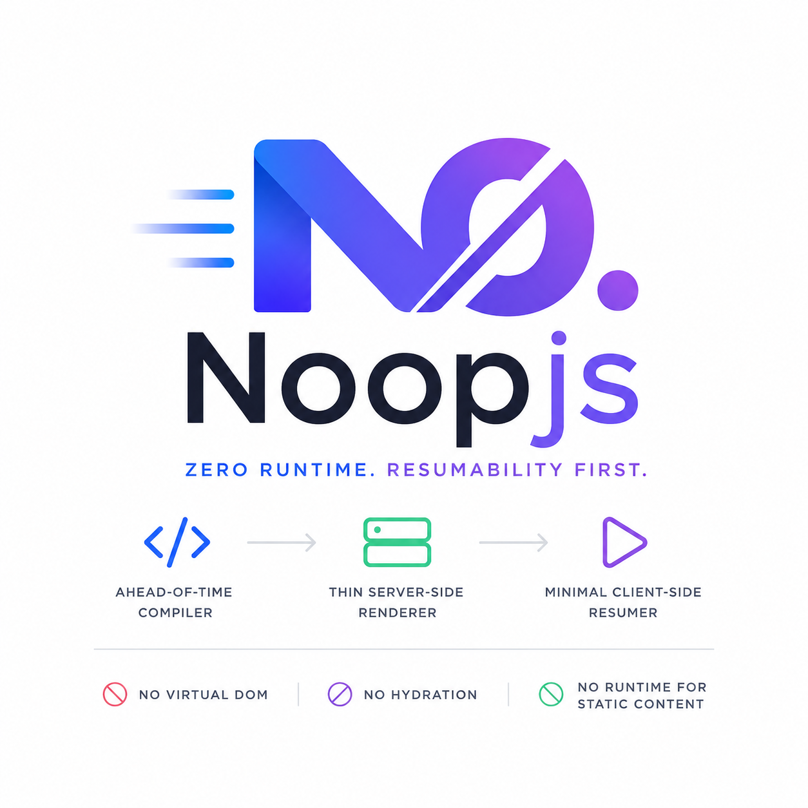

<p align="center">
  
</p>

<p align="center">
  
  
  
  
  
  
  
</p>

<p align="center">
  <a href="#quick-start">Quick Start</a> ·
  <a href="examples/blog">Live Demo</a> ·
  <a href="docs/index.html">Documentation</a> ·
  <a href="#roadmap">Roadmap</a>
</p>

```
    ╔══════════════════════════════════════════════════════════╗
    ║  .noop.tsx   ──►  Compiler  ──►  Vanilla JS            ║
    ║                    │                                     ║
    ║                    ├── SSR:  HTML + Serialized State     ║
    ║                    │         │                           ║
    ║                    │         ▼                           ║
    ║                    │    Client Runtime  ◄── 0–3.7 KB     ║
    ║                    │    (No hydration — just resume)     ║
    ║                    │                                     ║
    ║                    └── Atomic CSS  +  Tailwind v4        ║
    ║                        (Zero runtime CSS-in-JS)         ║
    ╚══════════════════════════════════════════════════════════╝
```

---

## Why NoopJS Exists

**AI generates code now.** Frameworks built on hooks, rules, and runtime contracts (React, Vue, Angular) were designed for humans. An AI doesn't need rules — it needs a framework that compiles away. NoopJS components are plain functions. No `useMemo`, no `useCallback`, no rules of hooks. The compiler handles everything.

**Performance is no longer optional.** Core Web Vitals are SEO signals. NoopJS delivers a 0.06s LCP on an SSR page — not in a benchmark, but in a real blog application with Tailwind CSS.

**The silos must break.** Components should work everywhere. NoopJS components compile to native Custom Elements on demand. Write once, embed anywhere.

**JavaScript bundles must shrink.** The average React page ships ~45 KB of framework JS. NoopJS ships **0 KB for static pages**, **466 B for resume** (counter fully interactive — signal, binding, handler), and **317 B inline + 3.5 KB cached shared runtime for SPA**.

---

## What's in the Box

```bash
npm install @noopjs/vite        # or scaffold: npm create noopjs
```

Then add one plugin to `vite.config.ts`:

```ts
import { noopVite } from '@noopjs/vite';

export default defineConfig({
  plugins: [noopVite()],
});
```

| What you get | Why it matters |
|---|---|
| **Compiler** | JSX → vanilla DOM. No framework code ships. |
| **Signals** | TC39-standard `signal`, `computed`, `effect`, `batch`. |
| **Atomic CSS** | Style objects → hashed utility classes. Zero runtime CSS-in-JS. |
| **SSR engine** | Render to HTML, serialize state, resume on client. True resumability. |
| **Client runtime** | 0 KB static, 466 B resume (inline), 317 B inline + 3.5 KB cached shared for SPA. Re-attaches signals to DOM without re-running components. Native `<link rel="prefetch">` eliminates JS prefetcher. |
| **SPA router** | Intercepts `<a>` clicks. View Transitions API. Native `<link rel="prefetch">`. |
| **Event delegation** | Single global listener. Handlers loaded lazily on first interaction. |
| **SPA security** | mXSS-immune page swaps via per-render sentinel manifest. ~50 bytes. No DOMPurify. |
| **Tailwind v4** | First-class token resolver. `token.spacing[6]` → `p-6`. |
| **Custom Elements** | Export as native Web Components via `@noopjs customElement` directive. |
| **CLI** | `dev`, `build`, `generate`, `analyze`, `check`, `init`. |
| **HMR** | Full hot module replacement in development. |

---

## Quick Start

```bash
npm create noopjs               # any tool: pnpm create, yarn create, bun create
# Pick a template: counter, blog, or empty
```

Or add to any existing Vite project:

```bash
npm install @noopjs/vite        # or: pnpm add, yarn add, bun add
```

```ts
// vite.config.ts
import { noopVite } from '@noopjs/vite';
export default defineConfig({ plugins: [noopVite()] });
```

```tsx
// src/counter.noop.tsx
import { signal } from '@noopjs/signals';

export const styles = {
  count: { fontSize: '24px', fontWeight: 'bold' },
  button: { padding: '8px 16px', cursor: 'pointer' },
};

export default function Counter() {
  const count = signal(0);
  return (
    <div>
      <p className={styles.count}>{count}</p>
      <button className={styles.button} onClick={() => count.set(count.get() + 1)}>
        Increment
      </button>
    </div>
  );
}
```

```ts
// src/main.ts
import Counter from './counter.noop';
document.getElementById('root')!.appendChild(Counter());
```

```bash
npx vite              # dev server
npx noopjs build      # production build
```

---

## Core Concepts

### Signals

Fine-grained reactivity following the TC39 proposal.

```ts
import { signal, computed, effect, batch } from '@noopjs/signals';

const count = signal(0);
const doubled = computed(() => count.get() * 2);

effect(() => console.log(count.get()));

batch(() => {
  count.set(1);
  count.set(2);
}); // effect runs once
```

### Compilation

The compiler transforms `.noop.tsx` into vanilla JavaScript at build time.

```tsx
// You write:
export default function Greeting(props: { name: string }) {
  return <div>Hello, {props.name}!</div>;
}
```

```js
// The compiler generates (simplified):
export default function Greeting(props) {
  const el = document.createElement('div');
  const txt = document.createTextNode('Hello, ' + props.name);
  el.appendChild(txt);
  return el;
}
```

No JSX at runtime. No framework imports. No VDOM. Just DOM.

### Resumability (Not Hydration)

Hydration runs a component on the client and diffs its output against server HTML — duplicate work. Resumption serializes the reactive graph and re-attaches it without running a single line of component code.

Per-page JavaScript payloads: **0 KB** for `client: none`, **466 B** gzipped for `client: resume` (polyfill + signals + bindings + inline handlers), **317 B** inline + **3.5 KB** cached shared runtime for `client: spa`.

### Client Capability Levels

A `// client:` directive at the top of a `.noop.tsx` file selects how much JS ships to the browser:

| Level | JS Payload | When to Use | Limits |
|-------|-----------|-------------|--------|
| `none` | 0 KB | Static content (about, 404, docs) | No interactivity at all |
| `resume` | ~500 B inline | Forms with validation, toggle buttons, counters | Fixed DOM structure only. Signals and handlers are re-bound without re-running the component. **Cannot create or remove DOM nodes dynamically.** Use only when the HTML structure is known at SSR time. |
| `spa` | ~550 B + 3.5 KB cached shared runtime | Dynamic lists, search results, async data, comment threads | Ships a shared router. The component function re-runs on signal changes, so dynamic content (`.map()`, conditionals) updates correctly. |
| `full` | same as spa | Everything | Currently the same as `spa`. Reserved for future use with fully client-rendered pages. |

**Key guidance:** If your page has content that changes based on user interaction (search results, filtered lists, toggled sections), use `client: spa`. The `resume` level is best for forms, toggles, and counters where the DOM structure is fixed and only values change.

```
         SSR                               Client
  ┌─────────────────┐              ┌──────────────────┐
  │                 │              │                  │
  │  signal(0)      │  ──state──►  │  signal(0)       │
  │  effect → DOM   │              │  effect → same   │
  │                 │   ◄─lazy──   │  DOM (no re-run) │
  │  handler click  │              │                  │
  └─────────────────┘              └──────────────────┘
```

### CSS

**NoopCSS** — Static style objects extract to atomic CSS classes at build time:

```tsx
export const styles = {
  card: { padding: '16px', borderRadius: '8px', display: 'flex', gap: '12px' },
};
// className={styles.card} → className="_a3f8b2 _c9e12a _e7d4b1"
```

**Tailwind v4** — First-class integration via token resolvers:

```tsx
import { token } from '@noopjs/runtime';

<div style={{ padding: token.spacing[6], color: token.color.blue[500] }}>
```

Resolves to `p-6`, `text-blue-500` at compile time. Both systems coexist on the same element:

```html
<div class="p-6 _a3f8b2">Tailwind + NoopCSS</div>
```

---

### SPA Security (mXSS-Immune by Construction)

Every other SPA router that uses `innerHTML` to swap pages is vulnerable to mutation XSS (mXSS) — parser-confusion attacks that bypass denylist sanitizers like DOMPurify. NoopJS takes a different approach.

When the SSR engine renders a component tree, it tags every element with a sequential `data-n` ID and records `{tag, attrs}` into a manifest that travels with the serialized state. On the client, before injecting the HTML, the verifier walks the parsed DOM and asks one question of each element: **"did the SSR engine emit you?"**

If the element lacks a `data-n` matching the manifest, it's removed. If its tag doesn't match, it's removed. If it carries attributes the SSR didn't emit, they're stripped. This isn't a denylist — it's a provenance check. An attacker cannot forge a valid `data-n` value because they don't control the SSR engine, and they cannot inject elements that survive the verification pass, because the browser's `innerHTML` parser cannot manufacture a valid sentinel.

**Result: provably mXSS-immune.** All 18 known mXSS payloads blocked, 0 bypasses. The verifier is ~50 bytes gzipped — zero dependencies, no DOMPurify overhead. This is only possible because NoopJS controls both the SSR engine and the client runtime — the same vertical integration that enables resumability.

---

## Packages

| Package | Version | Description |
|---|---|---|
| `@noopjs/signals` | 1.1.0 | TC39 Signals — `signal`, `computed`, `effect`, `batch`, `untrack`, `readonly` |
| `@noopjs/compiler` | 1.1.0 | Compiles `.noop.tsx` to vanilla JS. Exports `createTailwindResolver`. |
| `@noopjs/runtime` | 1.1.0 | Browser runtime — `bindText`, `bindEvent`, `bindStyle`, `onMount`, Context, Portals, Suspense |
| `@noopjs/client` | 1.1.0 | Client resumer — SSR hydration, SPA router, native prefetch |
| `@noopjs/server` | 1.1.0 | SSR engine — `renderToString`, `renderToStream`, file-based routing, caching |
| `@noopjs/vite` | 1.1.0 | Vite plugin — compiles `.noop.tsx`, extracts CSS, HMR, handler splitting |
| `@noopjs/css` | 1.1.0 | Atomic CSS extractor — `extractStyles()` converts style objects to atomic classes |
| `@noopjs/cli` | 1.1.0 | CLI — `dev`, `build`, `generate`, `analyze`, `check`, `init` |
| `create-noopjs` | 1.1.0 | `npm create noopjs` — project scaffolding with templates |

---

## Examples

```bash
cd examples/counter       # Minimal interactive component
npm run dev               # Client-rendered, signals + atomic CSS

cd examples/blog          # Full SSR blog with Tailwind
npm run ssr               # → http://localhost:3000 (0.06s LCP)
```

The blog example demonstrates SSR + Tailwind v4 + NoopCSS + SPA navigation + lazy handler loading end-to-end.

---

## Roadmap

### Layer 1 — Foundation (current)
- ✅ Signals (TC39 proposal)
- ✅ Compiler (JSX → DOM)
- ✅ NoopCSS (atomic extraction)
- ✅ Tailwind v4 integration
- ✅ SSR + resumability
- ✅ SPA router
- ✅ Custom Elements export
- ✅ HMR / dev server
- ✅ CLI

### Layer 2 — Production (next)
- 🔲 Design-system libraries
- 🔲 Image optimization
- 🔲 Streaming SSR improvements
- 🔲 i18n / l10n primitives
- 🔲 Form helpers
- 🔲 Performance budgets tooling
- 🔲 ESLint plugin
- 🔲 DevTools extension

### Layer 3 — Ecosystem (future)
- 🔲 Noop Cloud (serverless edge SSR)
- 🔲 AI scaffolding
- 🔲 Component marketplace
- 🔲 First-class mobile

---

## Contributing

NoopJS is open-source. Contributions of all kinds welcome — code, docs, bug reports, ideas.

- [Open an issue](https://github.com/noop-js/noopjs/issues)
- Submit a PR
- Improve the documentation in `docs/`
- Build example projects

---

## Maintainers

**Mohammed Boukaba** — Creator and lead developer.

NoopJS is built on a simple philosophy: the web doesn't need another framework. It needs one that gets out of the way.

---

<p align="center">
  <strong>LCP 0.06s · CLS 0 · INP 40ms · 0 KB static · 466 B resume · 317 B + 3.5 KB cached SPA</strong><br>
  <em>v1.1.0</em>
</p>
